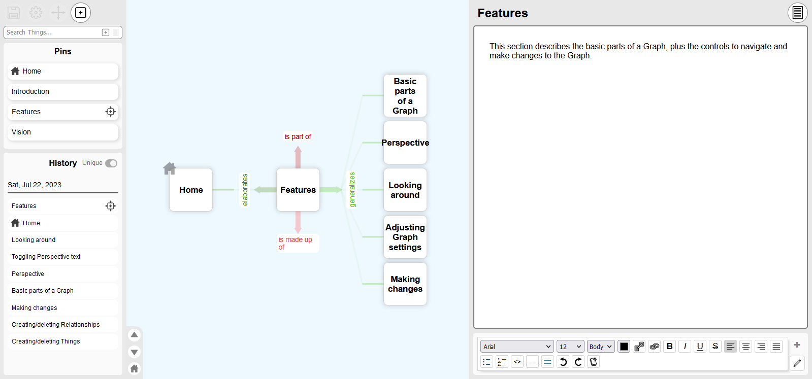

# Rig





## What is this?

Rig is an application that is focused on describing the connections between things. It's meant to be very general purpose so it can represent *any* topic as a set of "Things" connected together by "Relationships".

Rig was built by Mike Gravina (me), and it's still in active development. Right now it's very basic, but useful if you want a way to show how complex ideas or topics relate to each other. I'm hoping to eventually take it much further.

If you're interested in learning more about Rig before trying it, check out this [introductory video](https://www.dropbox.com/s/endhnqfxm86bfs6/How_to_use_Rig.mp4?dl=0).


## Getting in contact

If you need help setting up a copy of Rig, or are interested in contributing to the project, send me a message through GitHub or [email me directly](mailto:mtgravina@gmail.com).


## Platforms

Rig can be installed on a web server as a regular website (Linux is best), or it can be run locally on your computer as a desktop app (Windows only). See below for details on how to use it in both these ways.


## Setup


### Installation

After cloning the Git repository, run `npm i` to install dependencies and `npm run build` to build.


### Setting up Java

Rig requires Java for its back-end database. If you don't have it, you can get it [here](https://www.java.com/).


### Setting up WMIC

If you intend to run Rig as a desktop application on Windows, you'll need WMIC enabled. Older versions of Windows have it by default, but Windows 11 and onwards do not. [Here's a guide](https://www.intowindows.com/how-to-install-wmic-in-windows-11/) for re-enabling it if necessary.


### Setting up the environment file

The top-level folder of the repository contains a file named `env_template`. Copy and paste this without the "_template", and edit the new file to suit your needs. You can specify the desired ports for the app's main front-end server and its database server (if you need to change these to avoid conflicts with existing port usage). You will also need to supply your domain as "ORIGIN" in order to avoid cross-site errors. You can also change the port that the app runs on if you prefer.


### Setting up the authentication database

The /static/auth folder contains a file named `authentication_template.db`. Copy and paste it without the "_template" to create the database file that's necessary for user authentication.


### Setting up the config files

The /static/config folder contains two files in template form (with filenames ending in "_template"). Copy and paste them without the "_template", and modify the resulting config files as needed.

- **config.json**: As of now, this file should remain unmodified from the template. It's a placeholder that will contain information in future releases.

- **serverconfig.json**: This file can be modified to specify the desired port for the app's database server (if you need to change this to avoid conflicts with existing port usage). Note that this only applies if you are starting the file as a Windows desktop app using /static/app/start.bat, which is an experimental feature - otherwise ports are set as described below in "Running the application" and "Running the database backend". You can also set the path to the folder where Graph files will be stored.


### Setting up the customizable files

The /static/customizable folder contains two files in template form (with filenames ending in "_template"). Copy and paste them without the "_template", and modify the resulting config files as needed.

- **font-names.json**: This file contains an array of font names that will appear in the font drop-down menu of the Notes editor. Each font name must have a matching entry in notes-style.css (and, by extension, a matching font file in the `fonts` folder), unless you expect the font to already be present on users' systems.

- **notes-style.css**: This file contains CSS font declarations that enable the use of custom fonts in the app. Each entry must have a matching font file in the `fonts` folder, and the `font-family` must match a font name in `font-names.json`.


### Setting up logging

Rig uses the [Pino library](https://getpino.io) for logging. By default, it saves no log files to the server. You can change this behavior by following the steps below.

#### Enabling server-side logging

To enable logging to a server-side log file:

1. Create an empty log folder on the server.
2. Edit `static/config/serverconfig.json`, adding the absolute path to the new log folder as the value of the `logsFolder` key. You can also set the minimum level of messages to be logged by setting `logsLevel` to "trace", "debug", "info", "warn", "error", or "fatal" (if null, the log level defaults to "info").

#### Set up log rotation

Log files can grow to problematic sizes if they aren't regularly rotated and deleted. On Linux, we recommend using the [logrotate](https://linux.die.net/man/8/logrotate) utility for this purpose:

1. Install Logrotate on Linux:
`sudo apt-get-update`
`sudo apt-get install -y logrotate`
Or, on RHEL/CentOS:
`sudo yum update`
`sudo yum install -y logrotate`

2. Verify installation by checking that there is a line containing `cron.daily` in `/etc/crontab` or `/etc/anacrontab`.

3. Create the configuration file `/etc/logrotate.d/rig`, with the following contents:
```
    /<path to your Rig log directory>/rig_log.log {
        su root root
        daily
        rotate <number of days to keep log files>
        delaycompress
        compress
        notifempty
        missingok
        copytruncate
    }
```


### Running the application

#### Building the site

Before running the application as either a website or a desktop application, it has to be built. Go to the top-level folder of the repository and run the following command: `npm run build`.

#### Running as a website

If you are setting up on a Linux system, we recommend using [pm2](https://pm2.keymetrics.io/) to manage both the the front-end and back-end processes.  

Once pm2 has been installed, copy and paste the file named `/static/app/start_db_template.sh`, removing the "_template" from the copy. You can edit this file to change the port that the database back-end runs on if you prefer.

To start both the frontend and backend processes, run `pm2 start pm2.config.cjs` from the base folder of the repository.

#### Running as a desktop application

To run Rig as a desktop application (Windows only), execute the batch file located at `/static/app/start.bat`. (You can create a shortcut to this file if you want.)

When running in desktop mode, you will see taskbar icons for the back-end server (Java) and the front-end server (Node). The app UI will open in your default web browser. When closing the app, be sure to close both servers along with the web page.


## Terminology of a Graph


### Basic building block terminology

* **Thing**: 
A Thing is one of the two basic building blocks of a Graph. When defining a Thing,
we try to respect the "relational" model of representation, which says that Things
have no intrinsic attributes. They are, essentially, "empty". A Thing's attributes,
and more than that, its *identity*, are completely dependent on its Relationships.
With this in mind, a Thing can be described as a vertex in the network of a Graph -
whether that means an endpoint of a single Relationship, or a convergence point of
many Relationships.

* **Relationship**:
A Relationship describes the connection between two Things. Relationships form the
edges of the network of a Graph.
Because Relationships are bidirectional (one can go from the first Thing to the
second Thing, or from the second Thing to the first Thing), they are implemented
in Rig as pairs of relationship entries in the database. Both entries share the
same two endpoint Things, but they differ in terms of the Direction that those
Things are related in. The paired relationship entries always have opposite
Directions to one another.

* **Related Things**: 
Two Things connected by a Relationship are Related Things.

* **Direction**: 
A Direction represents a way that two Things can be related; in other words, a
Direction is a category that Relationships can belong to.

* **Opposite Direction**:
Each Direction has an Opposite Direction; in turn, that Opposite
Direction's own Opposite Direction is the first Direction.

* **Reciprocal Direction**
In rare cases, a Direction can be its own Opposite Direction. A good example is
the root Direction, "is related to", since by definition, if one Thing is related
to a second Thing, then the second Thing is also related to the first. A Direction
that is its own Opposite Direction is called a "Reciprocal Direction".

* **Space**: 
A Space is a set of Directions. (Identical to a set of Axes composed of these
Directions.)


### Graph terminology

* **Unigraph**: A network of Things connected by Relationships, stored as entries in
Rig's relational database.

* **Graph**: A network of Things connected by Relationships that serves to
visualize a bounded part of a Unigraph.

* **Perspective Thing**: The process of building a Graph works outwards from a
single starting Thing. Because the rest of the Graph is built in relation to this
starting Thing, and may depend on this Thing to determine many of its
characteristics, we say that the Graph is built "from the Perspective of" this
Thing, and call this Thing the Perspective Thing of the Graph.

* **Child/Parent Thing (of a Thing)**: After the Perspective Thing, other Things
are added into a Graph as Related Things to a Thing that already exists in the
Graph. Things added this way are called Child Things to the Thing that they are
first related to, and in return, that Thing is called their Parent Thing.

* **Thing Cohort** All Child Things in a single Direction from the Parent Thing. (Note
that if the Parent Thing's own Parent Thing is a Related Thing in that Direction,
the Thing Cohort does *not* include that "grandparent" Thing.)

* **Brood**: All Child Things of a single Parent Thing, regardless of Direction.
(Identical to all Thing Cohorts of a single parent Thing.)

* **Clade**: A Parent Thing, together with its Brood.

* **Parent Thing (of a Clade)**: The Parent Thing of the Clade's central Thing.
(Identical to the "grandparent" Thing of the Clade's peripheral Things.)

* **Generation**: As a Graph is build outward from a Perspective Thing, each
"step" of Relationships is called a Generation. The Perspective Thing itself
is considered Generation "0". All of its immediate Related Things (1 "step"
away from the Perspective Thing) are called Generation 1. Then, when the next
set of Things is added as Related Things from each of the Things in Generation
1, these new Things are called Generation 2, and so on.


### Graph display terminology

* **Axis**: Relationships are shown on one of several display "axes" in the
Graph viewer. These include 1. the vertical and horizontal screen axes; the
perpendicular axis (which emulates depth on the 2-dimensional screen); and
the "encapsulation" axis, which is made up of Things which either enclose
other Things or are enclosed by other Things.

* **Half-Axis**: Each Axis is composed of two opposite Half-Axes. The vertical
Axis is composed of 1 (Down) and 2 (Up). The horizontal Axis is composed of
3 (Right) and 4 (Left). The perpendicular Axis is composed of 5 (Away) and 6
(Towards). The encapsulation Axis is composed of 7 (Inwards) and 8 (Outwards).
When a Clade is displayed in a given Space, one pair of opposite Directions of
that Space is mapped to each Axis. Opposite Directions are generally mapped to
opposite Half-Axes.

* **Relationships Stem**: All of the Relationships for a given Relationship 
Cohort share a source Thing and a Direction, so they're shown in a way that
highlights these shared elements. The parts of all the Relationships closest
to the source Thing are joined together visually into a single "Stem".
Interacting with the Stem allows the user to perform operations on all the
Relationships in the Cohort at the same time.

* **Relationships Fan**: The "Fan" shows the separation of the Relationships
into separate Branches (see below). The diagonal lines of the fan are generally
displayed with a dotted stroke, in order to convey the idea that Relationships
are "orthogonal", i.e. that the non-diagonal lines of the Stem and Branches
represent ends of the true, "broken" line.

* **Relationships Branches**: The parts of the Relationships furthest from the
source Thing are shown as separate "Branches". Interacting with a Branch allows
the user to perform operations on a single Relationship at a time.

* **Portal**: A Clade that is shown with a discrete boundary, separating it from
the surrounding Graph. Generally a Clade is shown as a Portal when it adopts a
different Space from the Clade's Parent Thing, in order to clearly indicate that
Relationships within that Clade are on different axes.


## Layers of the application

* **Atomic models**: These represent basic constructs in the Unigraph. They
inherit the Objection.js `Model` class, and are based on queries of the
database.

* **Graph models**: These represent larger-scale or composite constructs built
up from atomic constructs. 

* **Widget models**: These contain the information necessary to set up
widgets. Each is based on an atomic or graph model (by which it represents an
atomic or graph construct).

* **Widgets**: These are the visual representation of atomic and graph
constructs. They are based on widget model.

* **Viewers**: Viewers are areas of the UI set up to visualize Graphs and
other information. They usually contain widgets.
